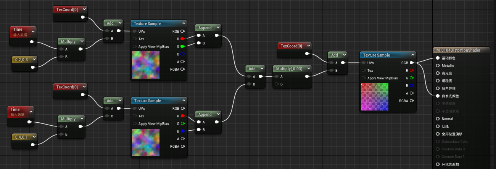
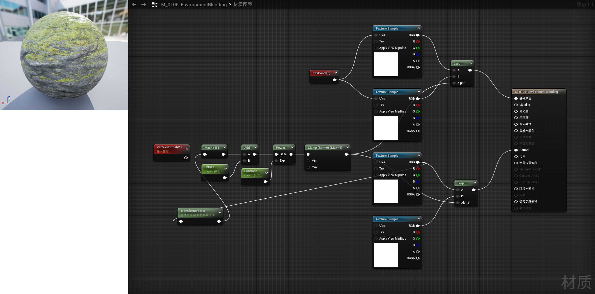

Main Link:

[UE4 Material Editor - Shader Creation](https://www.youtube.com/playlist?list=PL78XDi0TS4lFlOVKsNC6LR4sCQhetKJqs)

# 04 Distortion Shader

[Link](https://www.youtube.com/watch?v=gwx2NOZJ5CE&list=PL78XDi0TS4lFlOVKsNC6LR4sCQhetKJqs&index=4)

Extra videos:

[01](https://www.youtube.com/watch?v=yj7-h_X_eu4)

[02](https://www.youtube.com/watch?v=Q2UY8Pxl7kY)

[03](https://www.youtube.com/watch?v=sR0xV0TDvS8)

Extra resources:

[Unreal4 UV Tricks](http://www.tharlevfx.com/unreal-4-uv-tricks)

## Move Textures

TexCoord + Vec2

TexCoord + Time * Vec2

TexCoord + (Noise.x, Noise.y) * Intensity 实现材质扭曲

可以先对noise进行偏移，再通过Texcoord加到纹理上。

# 05 Flipbook Animation

[Link](https://www.youtube.com/watch?v=ZWAF_f2aP9s&list=PL78XDi0TS4lFlOVKsNC6LR4sCQhetKJqs&index=5)

# 06 Environment Blending

[Link](https://www.youtube.com/watch?v=QwVDlS8uiYg&list=PL78XDi0TS4lFlOVKsNC6LR4sCQhetKJqs&index=6)

使用世界空间法线B通道，在模型的上方混合一个新的材质。

从法线图中提取向上方向，可以更精确地进行混合。这里需要将法线的切线空间转换到世界空间。

切线空间：UVW。UV即纹理的UV，W为垂直UV远离模型表面的方向。[Wiki](https://en.wikipedia.org/wiki/Tangent_space_)

世界空间：世界坐标的XYZ。Z为绝对的向上方向。

[UE文档，Shader向量操作](https://docs.unrealengine.com/5.1/en-US/vector-operation-material-expressions-in-unreal-engine/#transform)

来自UE文档，将切线空间转换到查看空间(view space)制作Billboard效果。

# 07 Shader Performance Optimization

## 查看性能

### alt + 8

查看着色器复杂度，但只是一个概括性的表示。

### Shader instruction count

Shader Graph -> HLSL -> Assembly Instructions -> Graphics Driver

缺陷：

* 并非所有的指令消耗同样的时间。

* 不同平台需要不同的指令数量。

### Test on your target platform

实机测试，最准确的方式。

## 优化性能

### 删掉不要的东西

### 重构数学表达式

### 使用四维向量来减少重复的节点

### 将多张纹理合成在一张纹理中

Substance Painter的ORM
 
