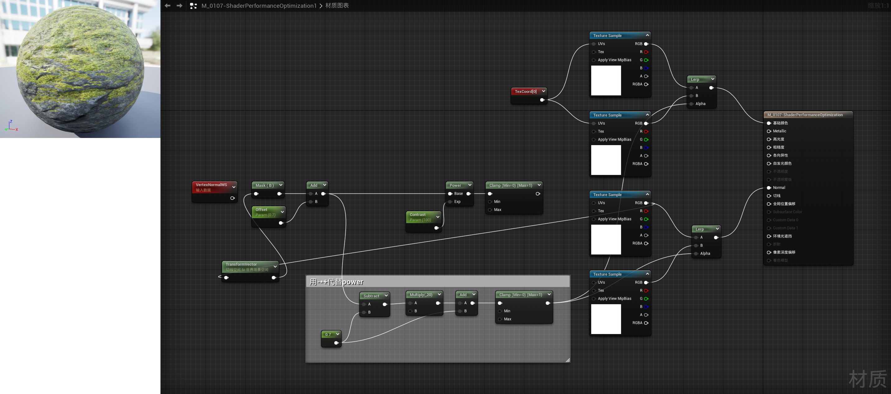
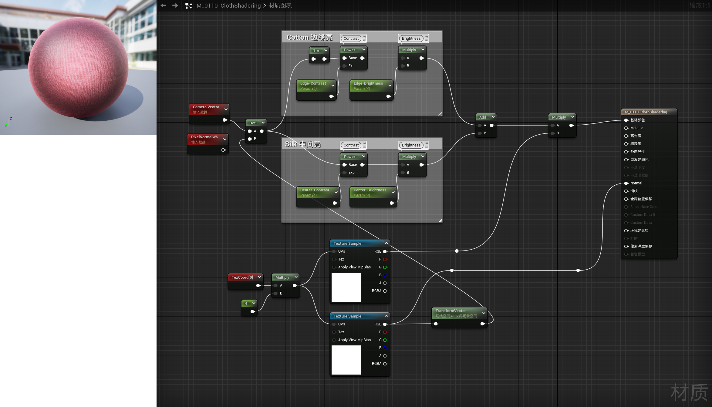

Main Link:

[UE4 Material Editor - Shader Creation](https://www.youtube.com/playlist?list=PL78XDi0TS4lFlOVKsNC6LR4sCQhetKJqs)

# 04 Distortion Shader

[Link](https://www.youtube.com/watch?v=gwx2NOZJ5CE&list=PL78XDi0TS4lFlOVKsNC6LR4sCQhetKJqs&index=4)

Extra videos:

[01](https://www.youtube.com/watch?v=yj7-h_X_eu4)

[02](https://www.youtube.com/watch?v=Q2UY8Pxl7kY)

[03](https://www.youtube.com/watch?v=sR0xV0TDvS8)

Extra resources:

[Unreal4 UV Tricks](http://www.tharlevfx.com/unreal-4-uv-tricks)

## Move Textures

TexCoord + Vec2

TexCoord + Time * Vec2

TexCoord + (Noise.x, Noise.y) * Intensity 实现材质扭曲

可以先对noise进行偏移，再通过Texcoord加到纹理上。

# 05 Flipbook Animation

[Link](https://www.youtube.com/watch?v=ZWAF_f2aP9s&list=PL78XDi0TS4lFlOVKsNC6LR4sCQhetKJqs&index=5)

# 06 Environment Blending

[Link](https://www.youtube.com/watch?v=QwVDlS8uiYg&list=PL78XDi0TS4lFlOVKsNC6LR4sCQhetKJqs&index=6)

使用世界空间法线B通道，在模型的上方混合一个新的材质。

从法线图中提取向上方向，可以更精确地进行混合。这里需要将法线的切线空间转换到世界空间。

切线空间：UVW。UV即纹理的UV，W为垂直UV远离模型表面的方向。[Wiki](https://en.wikipedia.org/wiki/Tangent_space_)

世界空间：世界坐标的XYZ。Z为绝对的向上方向。

[UE文档，Shader向量操作](https://docs.unrealengine.com/5.1/en-US/vector-operation-material-expressions-in-unreal-engine/#transform)

来自UE文档，将切线空间转换到查看空间(view space)制作Billboard效果。

# 07 Shader Performance Optimization

[Link](https://youtu.be/D8E47BJOE6E?list=PL78XDi0TS4lFlOVKsNC6LR4sCQhetKJqs)

## 查看性能

### alt + 8

查看着色器复杂度，但只是一个概括性的表示。

### Shader instruction count

Shader Graph -> HLSL -> Assembly Instructions -> Graphics Driver

缺陷：

* 并非所有的指令消耗同样的时间。

* 不同平台需要不同的指令数量。

### Test on your target platform

实机测试，最准确的方式。

## 优化性能

### 删掉不要的东西

### 重构数学表达式

### 使用四维向量来减少重复的节点

### 将多张纹理合成在一张纹理中

比如Substance Painter的ORM
 
# 08 Bump Offset and Parallax Occlusion Mapping

[Link](https://www.youtube.com/watch?v=wc0StMr3CQo&list=PL78XDi0TS4lFlOVKsNC6LR4sCQhetKJqs&index=8)

## BumpOffset

输入一张高度图，再对原有纹理采样。

## Parallax Occlusion Mapping

输入纹理对象，高度比率，参考平面。节点采用射线对纹理进行采样。需要消耗更多的性能。

修改Min/Max Steps改变高度的精度。

# 09 Texture Compression and Settings

[Link](https://www.youtube.com/watch?v=h95X255NhOo&list=PL78XDi0TS4lFlOVKsNC6LR4sCQhetKJqs&index=9)

[DXT参考资料](http://wiki.polycount.com/wiki/DXT)

DXT1能使容量减少到1/8，DXT5能使容量减少到1/4。

Aplha压缩：只会使用Alpha通道。

如果不需要使用颜色，关闭sRGB。

# 10 Cloth Shader

[Link])https://www.youtube.com/watch?v=LUfG5ojx0O4&list=PL78XDi0TS4lFlOVKsNC6LR4sCQhetKJqs&index=10)

布料特点：

1. 针织布料的边缘有些许突起的纤维，使得有亮光

2. Satin（缎子）相反，边缘更暗。直面的区域更亮。

3. 丝绸同理，面向光源或摄像机的表面更亮。

[神秘海域4的布料效果](https://www.artstation.com/artwork/6kEmV)

[Siggraph的ppt](http://advances.realtimerendering.com/s2010/Hable-Uncharted2(SIGGRAPH%202010%20Advanced%20RealTime%20Rendering%20Course).pdf)，布料算法在第80页。

菲涅尔效果：相机向量点乘像素法线。像素法线可以用法线图（需要transform）。

使用菲涅尔+反菲涅尔改变边缘或中间的亮度。

